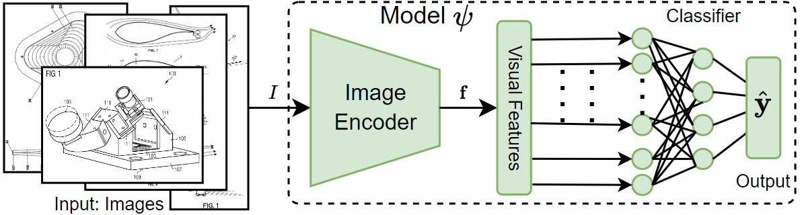

Note: This repository will be fully updated once get the official notification.

# Classification of Visualization Types and Perspectives in Patents

This repository represents the implementation for public work "Classification of Visualization Types and Perspectives in Patents"

# Full paper
https://link.springer.com/chapter/10.1007/978-3-031-43849-3_16 

# Methodology Pipeline



## Get started (Requirements and Setup)
Python version >= 3.9

## Datasets

Extended_CLEF_IP_2011_Dataset: https://zenodo.org/records/10019328

USPTO_PIP_Dataset: https://zenodo.org/records/10019506

## Training and testing
```bash
train.py -b 32 --epochs 200 --workers 1 --lr 0.001 --batchbalance yes --augmentdata yes --basemodel resnext101_64x4d --featureSize 2048 --featurelayer -1 --imageSize 224 --output ./outputDir

```

